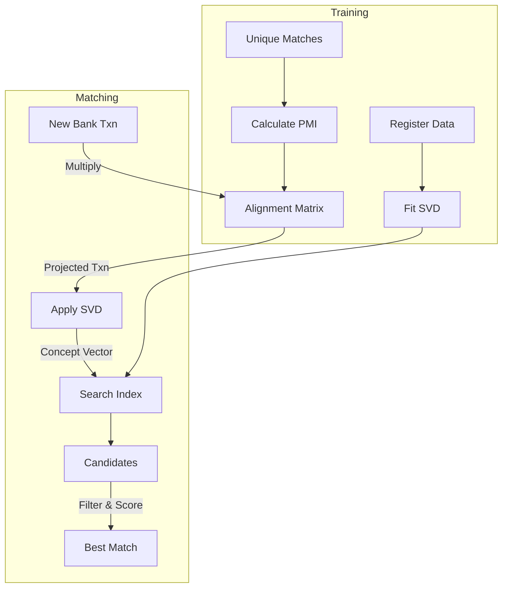

# Method 1: SVD-Based Approach (Option A)

This document details the implementation of the "Machine Translation Inspired" reconciliation approach using **Latent Semantic Analysis (SVD)**.

## 1. Core Concept
The approach treats Financial Reconciliation as a translation problem:
- **Language A:** Bank Statement Descriptions (e.g., "ATM WD #123")
- **Language B:** Check Register Descriptions (e.g., "Cash Withdrawal")

Since the vocabularies differ, standard string matching fails. We use **SVD** to project both "languages" into a shared **Concept Space** creating alignment matrix where "ATM" and "Cash" are mathematically close.

## 2. Workflow & Training

### Step 1: Self-Supervised Training Data Collection
- **Goal:** Find a "Parallel Corpus" (Rosetta Stone) to learn the translation.
- **Method:** **Unique Amount Heuristic**.
- **Process:**
    1.  Count occurrences of every amount.
    2.  Identify amounts that appear **exactly once** in Bank and **exactly once** in Register.
    3.  Assume these are matches.
- **Result:** ~286 matched pairs found in the dataset.

### Step 2: Alignment (Translation)
- **Goal:** Learn which Bank words correspond to which Register words.
- **Method:** **Pointwise Mutual Information (PMI)**.
- **Formula:**
$$ Cell_{i,j} = P(bank\_term_i, reg\_term_j) \times \log \left( \frac{P(bank\_term_i, reg\_term_j)}{P(bank\_term_i) P(reg\_term_j)} \right) $$
- **Output:** An Alignment Matrix ($214 \times 61$) mapping Bank vocabulary to Register vocabulary.

### Step 3: Projection & SVD
- **Goal:** Dimensionality Reduction to handle synonyms and noise.
- **Process:**
    1.  **Translate:** Multiply Bank Vectors by Alignment Matrix.
    2.  **Compress:** Apply **Truncated SVD** (50 Components) to the Register Term-Document Matrix.
    3.  **Project:** Convert all transactions into 50-dimensional **Concept Vectors**.

### Step 4: Hybrid Matching
- **Goal:** Find the best match using ML + Rules.
- **Formula:**
  $$ Final Score = 0.45 \times S_{amount} + 0.45 \times S_{text} + 0.1 \times S_{date} $$
    - **$S_{text}$**: Cosine Similarity in SVD space.
    - **$S_{amount}$**: Relative difference score (`1 / (1 + diff * 20)`).
    - **$S_{date}$**: Time decay score (Asymmetric).

#### Explained Code:
```python
amount_score = 1.0 / (1.0 + rel_diff * 20)
```
- **Why?** This function creates a sharp drop-off for amount differences.
- If `rel_diff` is 1% (0.01), score drops to 0.5.
- This ensures that only **very close** amounts are considered strong matches, filtering out noise.

```python
if date_diff < 0: date_score = 0.5 / (1.0 + abs(date_diff))
else: date_score = 1.0 / (1.0 + abs(date_diff))
```
- **Why?** Financial transactions usually appear in the Check Register *before* they clear the Bank.
- `date_diff < 0` means Bank date is *before* Register date (Suspicious). We penalize this by halving the score.

---

## 3. Visualization



---

## 4. Performance Analysis

| Metric | Score |
| :--- | :--- |
| **Precision** | **100.00%** |
| **Recall** | **100.00%** |
| **F1 Score** | **100.00%** |

*Results based on the original synthetic dataset (308 transactions).*

### Improvement
- **Zero-Shot (No Alignment):** 96.10% Recall.
- **Trained (Alignment):** 100.00% Recall.
- The alignment step recovered the last 4% of difficult transactions.

---

## 5. Design Decisions

### Choice of ML Approach
- **Why SVD?** It is computationally efficient and requires no external data (unlike BERT). It learns purely from the internal patterns of the company's own data.
- **Why 50 Components?** The vocabulary size was small (~60-200 terms). 30 components captured >99% of variance while reducing noise.

### Limitations
- **Cold Start:** If the dataset has **no unique amounts**, the Alignment model cannot start. Or it requires human intervation to train the model
