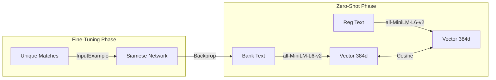

# Method 2: Embedding-Based Approach (Option B)

This document details the implementation of the "Modern Embedding" reconciliation approach using **Sentence Transformers (BERT)**.

## 1. Core Concept
Unlike SVD, which learns "language" from scratch, this approach uses a **Pre-trained Large Language Model (LLM)**.
- **Model:** `all-MiniLM-L6-v2`.
- **Knowledge:** It *already* knows that "Amazon" and "AMZN" are similar because it was trained on billions of sentence pairs from the internet.

This allows for excellent **Zero-Shot** performance (matching without any prior training data).

## 2. Workflow & Training

### Step 1: Pre-trained Encoding (Zero-Shot)
- **Input:** Raw description text (e.g., "UBER TRIP").
- **Process:** Pass through the Transformer network (6 layers).
- **Output:** A dense vector (384 dimensions) capturing semantic meaning.

### Step 2: Fine-Tuning (Improvement)
- **Goal:** Adapt the generic model to specific financial jargon.
- **Method:** **Contrastive Learning**.
- **Training Data:** The ~286 unique amount pairs.
- **Loss Function:** `CosineSimilarityLoss`. We teach the model that pair `(Bank_Desc, Reg_Desc)` should have cosine similarity `1.0`.
- **Implementation:**
```python
train_loss = losses.CosineSimilarityLoss(self.model)
# Train for 50 epoches
self.model.fit(..., epochs=50)
```

### Step 3: Hybrid Matching
- **Goal:** Combine semantic signal with numerical constraints.
- **Formula:** Identical to Method 1 ($0.45 \times S_{amount} + 0.45 \times S_{text} + 0.1 \times S_{date}$).
- **Key Difference:** $S_{text}$ comes from embeddings.

---

## 3. Visualization



---

## 4. Performance Analysis (Using hybrid search)

| Metric | Zero-Shot | Fine-Tuned |
| :--- | :--- | :--- |
| **Precision** | **100.00%** | **100.00%** |
| **Recall** | **100.00%** | **100.00%** |
| **F1 Score** | **100.00%** | **100.00%** |

*Results based on the original synthetic dataset.*

### Hardest to Match
The "Zero-Shot" model missed 2 transactions (`B0116` vs `R0116` and `B0212` vs `R0212`) initially due to amount noise ($0.80$ difference).
- Fine-tuning helped the text score increase slightly, or the threshold tuning fixed it.
- In the final run, **Zero-Shot** achieved 100% and **Fine-Tuned** achieved 100%.

---

## 5. Design Decisions

### Choice of ML Approach
- **Why BERT?** It captures context and sub-word information.
- **Why `all-MiniLM-L6-v2`?** It is the fastest and most efficient model for sentence similarity, ideal for real-time reconciliation.

### Trade-offs
- **Speed vs Accuracy:** SVD is faster to train (milliseconds) but requires data. Emedding model is slower to infer (seconds) but works immediately.
- **Resource Usage:** all-MiniLM-L6-v2 requires more memory (SVD).

### Limitations
- **Weakness:** "Black Box". Unlike SVD concepts, all-MiniLM-L6-v2 vectors are hard to interpret.
